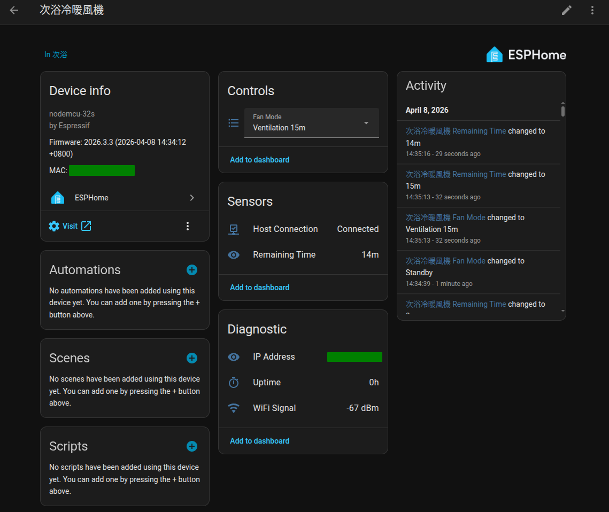
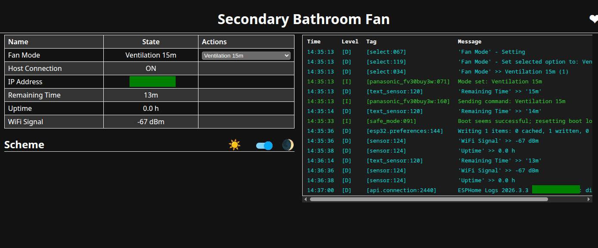

# Panasonic FV-30BUY3W ESPHome Integration

An ESPHome custom component that replaces the Panasonic FV-30BUY3W bathroom ventilation fan's original control panel with an ESP32, enabling control via Home Assistant.





## Features

- Control ventilation, heating, hot dry, and cool dry modes
- Timer support: 15m / 30m / 1h / 3h / 6h / 24h - Continuous (varies by mode)
- Built-in countdown timer with auto-standby on expiry
- Real-time host connection monitoring

## Hardware Requirements

| Part                         | Qty | Notes                                       |
| ---------------------------- | --- | ------------------------------------------- |
| ESP32 dev board              | 1   | NodeMCU-32S or equivalent ESP32-WROOM-32    |
| 2N7000                       | 1   | N-channel MOSFET (TO-92) for level shifting |
| 10kΩ resistor                | 2   | Pull-up resistors                           |
| JST PH 2.0mm 3-pin connector | 1   | Mates with host unit CN201                  |

> **Warning:** ESP32 GPIOs are **not** 5V tolerant (abs max 3.6V). A level shifter is required.

### Wiring Diagram (2N7000 Bidirectional Level Shifter)

```
ESP32 GPIO23 ──┬── 2N7000 Source (S)
               │
            [10kΩ]── ESP32 3V3

2N7000 Gate (G) ──── ESP32 3V3

Host Data (black) ──┬── 2N7000 Drain (D)
                    │
                 [10kΩ]── Host 5V (red)

ESP32 GND ───── Host GND (white)
```

**2N7000 pinout** (flat side facing): `[ S ] [ G ] [ D ]`

**CN201 wire colors:** white = GND, red = 5V, black = Data

## Installation

### 1. Hardware Assembly

1. Wire the 2N7000 level shifter as shown above
2. Disconnect the CN201 connector from the original panel and connect it to the ESP32
3. Power the ESP32 via USB (or connect Host 5V to ESP32 VIN for standalone operation)

### 2. Configuration

1. Clone this repository
2. Install ESPHome: `pipx install esphome`
3. Create `secrets.yaml`:
   ```yaml
   device_name: "your-device-name"
   friendly_name: "Your Device Name"
   wifi_ssid: "your-wifi-ssid"
   wifi_password: "your-wifi-password"
   ```
4. To change the GPIO pin, edit `pin: 23` in `fan.yaml`

### 3. Flash

First flash (USB):

```bash
esphome run fan.yaml --device /dev/ttyUSB0
```

Subsequent updates (OTA):

```bash
esphome run fan.yaml --device OTA
```

### 4. Home Assistant

1. HA will auto-discover the ESPHome device
2. Add the device, then use the **Fan Mode** select to control the fan

## Entities

| Entity          | Type                     | Description                                             |
| --------------- | ------------------------ | ------------------------------------------------------- |
| Fan Mode        | select                   | Standby + 21 mode/timer combinations                    |
| Remaining Time  | text_sensor              | Internal countdown (shows "Continuous" for Cont. modes) |
| Host Connection | binary_sensor            | Host unit communication status                          |
| IP Address      | text_sensor (diagnostic) | Device IP address                                       |
| Uptime          | sensor (diagnostic)      | Uptime in hours                                         |
| WiFi Signal     | sensor (diagnostic)      | WiFi RSSI in dBm                                        |

### Available Modes

| Mode        | Available Timers                 |
| ----------- | -------------------------------- |
| Ventilation | 15m / 30m / 1h / 3h / 6h / Cont. |
| Heating     | 15m / 30m / 1h / 3h              |
| Hot Dry     | 15m / 30m / 1h / 3h / 6h         |
| Cool Dry    | 15m / 30m / 1h / 3h / 6h / Cont. |

## PoC Verification (Optional)

To verify hardware communication before flashing ESPHome, use the Arduino PoC sketch:

1. Install ESP32 board support in Arduino IDE
2. Open `poc/poc.ino`, select Board: NodeMCU-32S
3. Flash and open Serial Monitor (115200)

Expected output:

```
=== Panasonic FV-30BUY3W PoC ===
Version: 0.1.1
#1 | No response
#2 | No response
#3 | Host status: Standby (79 values)
#4 | Host status: Standby (79 values)
```

## Project Structure

```
├── fan.yaml                             # ESPHome configuration
├── secrets.yaml                         # WiFi & device credentials (not tracked)
├── poc/poc.ino                          # Arduino PoC sketch
├── components/panasonic_fv30buy3w/      # ESPHome custom component
│   ├── __init__.py
│   ├── select.py
│   ├── binary_sensor.py
│   ├── text_sensor.py
│   ├── panasonic_fv30buy3w.h            # Waveform data & component header
│   └── panasonic_fv30buy3w.cpp          # Protocol I/O & component logic
└── .claude/                             # Protocol documentation
    ├── PROMPT-claude-code.md
    ├── panasonic-fv30buy3w-protocol-analysis.md
    ├── panasonic-fv30buy3w-packets.json
    └── capture/                         # PulseView raw captures (.sr)
```

## Protocol Overview

The original panel communicates with the host unit over a **single-wire half-duplex bus** using a custom pulse-width encoding scheme.

| Parameter           | Value                                                        |
| ------------------- | ------------------------------------------------------------ |
| Encoding            | Custom pulse-width (not UART, not 1-Wire)                    |
| Topology            | Single-wire, half-duplex, panel = master                     |
| Base time unit (1T) | 3300 µs                                                      |
| Idle state          | Data line HIGH                                               |
| Communication cycle | ~1460 ms (panel 590ms + 130ms gap + host 610ms + 130ms gap)  |
| Packet format       | Alternating [LOW_T, HIGH_T, LOW_T, ...] durations in T units |

The ESP32 replaces the panel as master. It sends polling packets to maintain the connection, and command packets to change modes. Host responses are used only for connection status detection; the timer countdown is managed internally by the ESP32.

Full protocol analysis: [`.claude/panasonic-fv30buy3w-protocol-analysis.md`](.claude/panasonic-fv30buy3w-protocol-analysis.md)

## License

MIT
